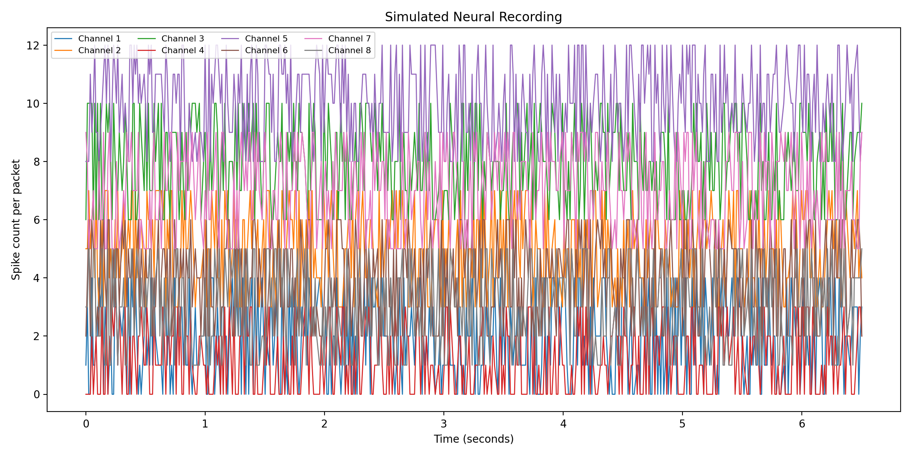
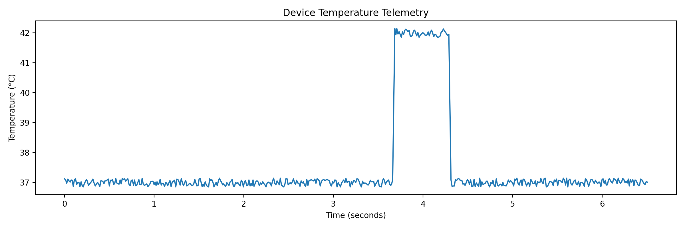
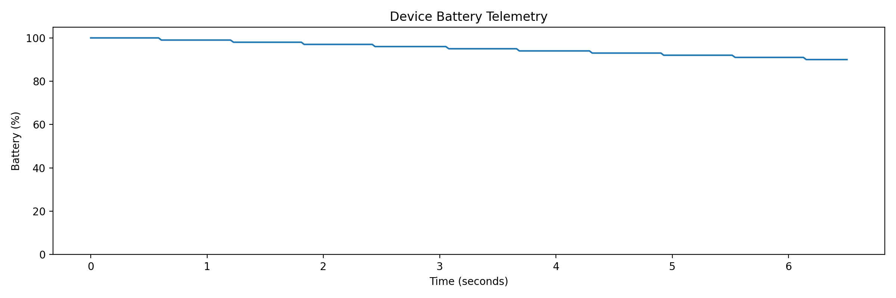

# Neural Recording Device Communication SDK

A software simulation of a neural recording device communication pipeline built with **Python** and **Rust**. The project demonstrates protocol design, binary packet serialization, CRC-based integrity verification, TCP communication, data recording, and visualization in a production-inspired workflow.

**Status:** MVP completed. Planned extensions include fault injection, asynchronous networking, automated acceptance testing, and device-state management.

---

# Overview

This project simulates the software pipeline used to communicate with a neural recording device. The simulator emulates a device by generating eight channels of synthetic spike-count data together with device telemetry, including sequence numbers, timestamps, battery percentage, and temperature.

A Rust SDK client connects to the simulated device over TCP, validates packet integrity, decodes the custom binary protocol, records validated packets to disk, and exports the recording for downstream visualization.

The project focuses on software reliability, protocol validation, and communication between independent software components written in different programming languages.

---

# Architecture

```text
Python Neural Device Simulator
             │
             │ TCP Binary Stream
             ▼
Rust SDK Client
             │
             │ Packet Decoding
             │ CRC32 Validation
             │ Sequence Verification
             ▼
CSV Recorder
             │
             ▼
Python Visualization Pipeline
```

---

# Features

- Python-based neural recording device simulator
- Synthetic eight-channel neural spike-count generation
- Channel-specific baseline firing behavior
- Timestamped and sequentially numbered data packets
- Custom fixed-size binary communication protocol (40-byte packets)
- Big-endian network byte order
- CRC32 packet integrity verification
- TCP communication between Python and Rust
- Protocol-version validation
- Message-type validation
- Sequence-number verification
- Cross-language communication between Python and Rust
- CSV recording of validated packets
- Neural activity visualization
- Device telemetry visualization

---

# Binary Protocol

Each transmitted packet is exactly **40 bytes**.

| Field | Size |
|-----------------------|------:|
| Magic bytes | 2 bytes |
| Protocol version | 1 byte |
| Message type | 1 byte |
| Sequence number | 4 bytes |
| Device timestamp | 8 bytes |
| Channel count | 1 byte |
| Eight spike counts | 16 bytes |
| Battery percentage | 1 byte |
| Temperature | 2 bytes |
| CRC32 checksum | 4 bytes |

The complete protocol specification is available in:

```
docs/protocol-v1.md
```

---

# Example Recording Session

During a representative recording session, the Rust SDK successfully processed **500 consecutive packets** while maintaining protocol integrity.

| Metric | Value |
|---------------------|------:|
| Valid packets | 500 |
| Rejected packets | 0 |
| Sequence warnings | 0 |

---

## Simulated Neural Activity



---

## Device Temperature



---

## Device Battery



---

# Repository Structure

```text
biodevice-sdk/
│
├── docs/
│   └── protocol-v1.md
│
├── figures/
│   ├── neural_channels.png
│   ├── temperature.png
│   └── battery.png
│
├── recordings/
│   └── session.csv
│
├── rust-client/
│   ├── Cargo.toml
│   └── src/
│       └── main.rs
│
├── simulator/
│   ├── device_simulator.py
│   └── plot_recording.py
│
├── .gitignore
├── LICENSE
└── README.md
```

---

# Running the Project

## 1. Start the simulated neural device

```bash
cd simulator
python3 device_simulator.py
```

The simulator starts a TCP server at

```
127.0.0.1:9000
```

and continuously streams neural data packets.

---

## 2. Run the Rust SDK client

Open a second terminal.

```bash
cd rust-client
cargo run
```

The Rust client

- connects to the simulated device
- validates every packet using CRC32
- verifies sequence numbers
- decodes the binary protocol
- records validated packets into

```
recordings/session.csv
```

---

## 3. Generate visualizations

From the project root

```bash
python3 simulator/plot_recording.py
```

This generates

- Neural activity plot
- Temperature telemetry plot
- Battery telemetry plot

inside

```
figures/
```

---

# Technologies

### Languages

- Rust
- Python

### Networking

- TCP sockets

### Data Formats

- Binary serialization
- CSV

### Validation

- CRC32

### Data Analysis & Visualization

- Pandas
- Matplotlib

---

# Future Work

- Fault injection (packet corruption, packet loss, duplicate packets, delayed packets)
- Automatic reconnection after communication failure
- Device state machine
- Recorder command-line interface
- Structured logging and operational metrics
- Asynchronous networking using Tokio
- Automated manufacturing acceptance tests
- Real-time monitoring dashboard
- Property-based testing
- Packet parser fuzz testing

---

# Disclaimer

This project is intended for educational and research purposes and is not intended for clinical or medical use.